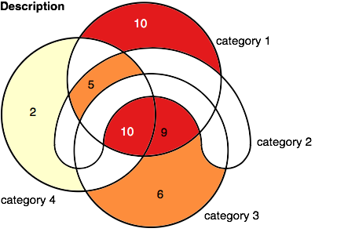
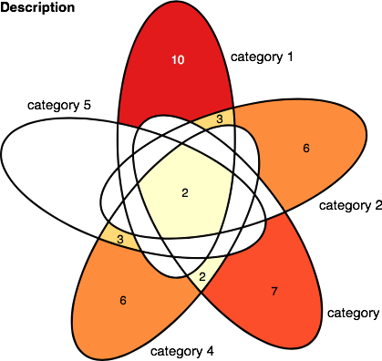
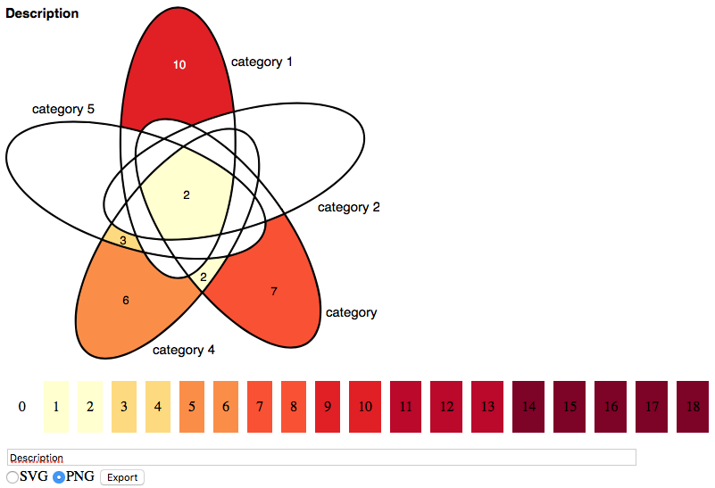

# 4/5 sets venn diagram generator

A basic browser-based tool for Venn diagram production. Exports to SVG and PNG.

## Showcase

Venn diagram with 4 sets.

Venn diagram with 5 sets.

Interface of the tool.

## Usage

It's really simple.

- Download as zip or clone the repository to your computer.
- Edit the color scale and category names settings in `config.js`.
- Open `venn4.html` or `venn5.html` and fill in the colors (click on the region to select it, click on the color to fill the region).

## Authors

Based on code created by Lukáš Daněk, additional functionality added by Jan Martinek.

## License

**MIT.** Use, copy, modify, merge, publish, distribute… and see [LICENSE](LICENSE) file.
